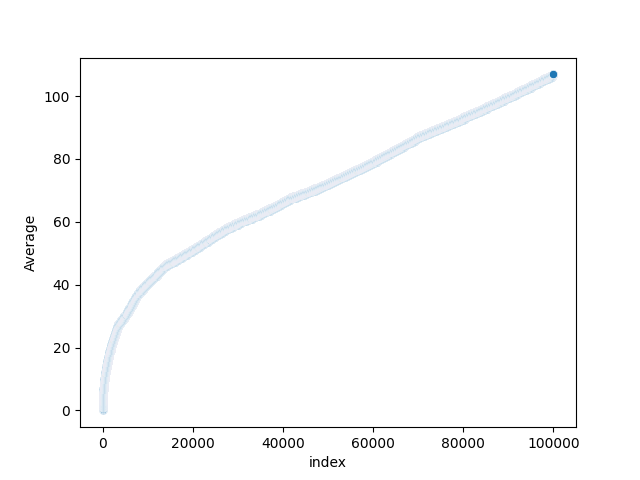

# inventory-sequence
This script generates the [inventory sequence](https://www.youtube.com/watch?v=rBU9E-ZOZAI) (see also [here](https://oeis.org/search?q=inventory&language=english&go=Search)). 

output: `[0, 1, 1, 0, 2, 2, 2, 0, 3, 2, 4, 1, 1, 0, 4, 4, 4, 1, 4, 0, 5, 5, 4, 1, 6, 2, 1, 0, 6, 7, 5, 1, 6, 3, 3, 1, 0, 7, 9, 5, 3, 6, 4, 4, 2, 0, 8, 9, 6, 4, 9, 4, 5, 2, 1, 3, 0, 9, 10, 7, 5, 10, 6, 6, 3, 1, 4, 2, 0, 10, 11, 8, 6, 11, 6, 9, 3, 2, 5, 3, 2, 0, 11, 11, 10, 8, 11, 7, 9, 4, 3, 6, 4, 5, 0, 12, 11, 10, 9, 13]`

# Plotting with Seaborn
## Basic Scatterplots
Scatterplot of 1000 numbers:

Scatterplot of 10000 numbers:

Scatterplot of 100,000 numbers:

## Plotting the Average as $n \to \infty$
Scatterplot of the first 10 averages:

Scatterplot of the first 100 averages:

Scatterplot of the first 1,000 averages:

Scatterplot of the first 10,000 averages:

Scatterplot of the first 100,000 averages:
